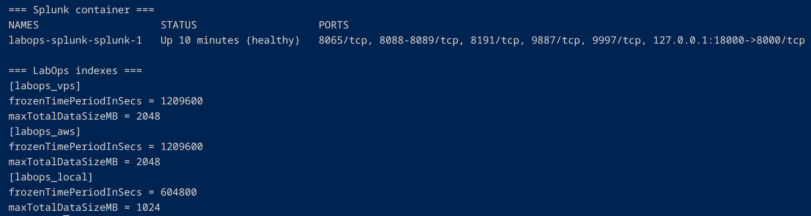
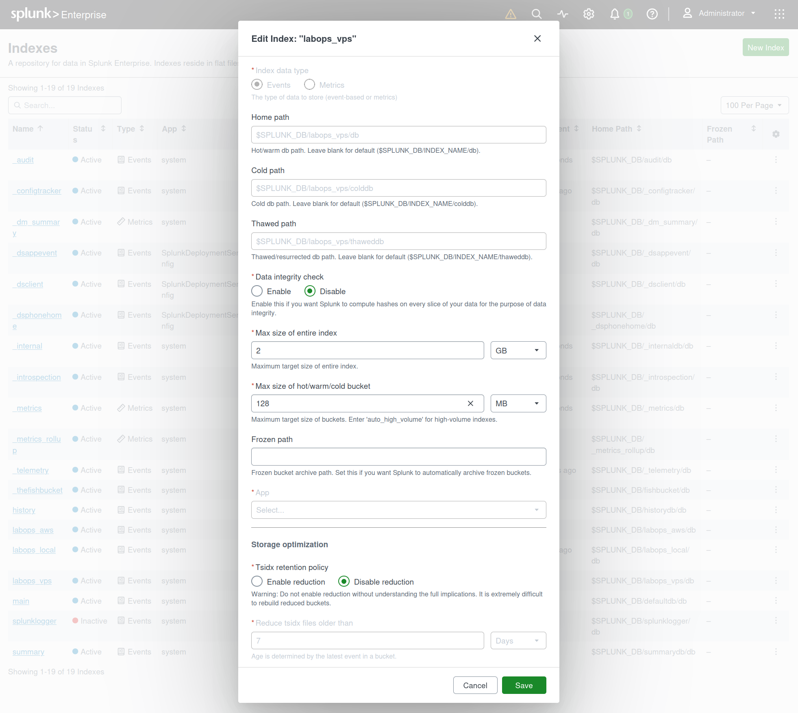
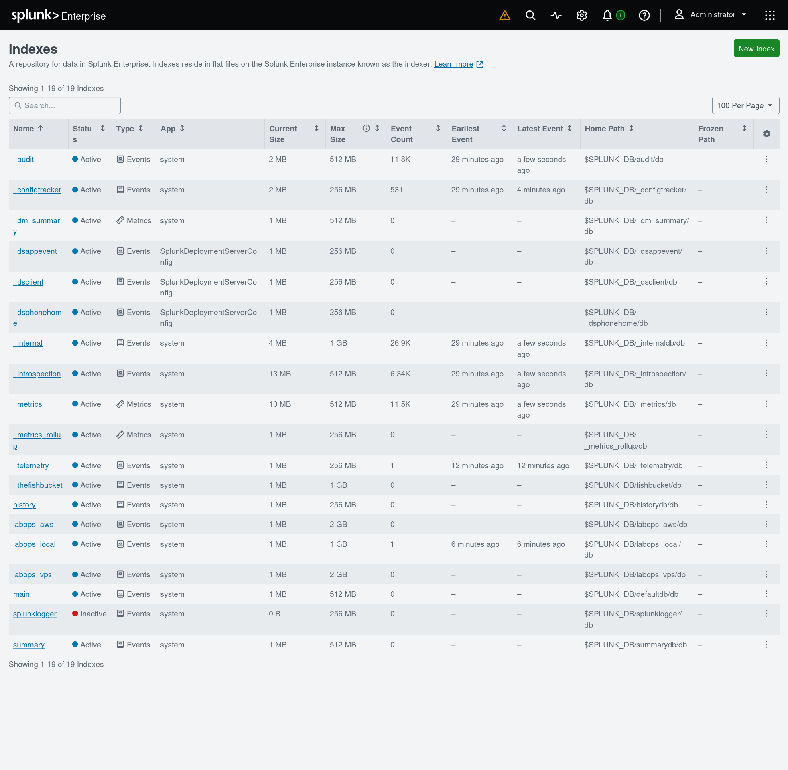
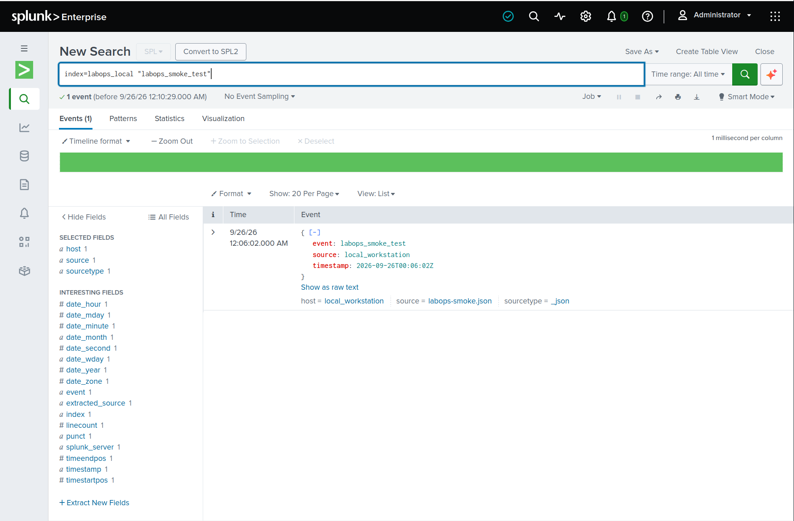

# LabOps Observability

Local-first operational and security telemetry for a home lab, a long-running Hetzner VPS, and disposable AWS infrastructure.

> **Status (2026-09-26): Local Splunk deployment and ingestion smoke test complete.** Splunk Enterprise is healthy, the Developer Personal License is active, all 19 indexes have verified size limits, and a synthetic JSON event was uploaded and retrieved from `labops_local`. Continuous Hetzner/AWS ingestion and alerting are not configured yet.

## Purpose

Build a reproducible, documented observability environment that can ingest and investigate genuine application, operating-system, web-server, authentication, and infrastructure events. The deployment will start with local test data, then add the Hetzner staging VPS, and finally collect telemetry from short-lived AWS three-tier/Kubernetes lab runs.

This project uses **Splunk Enterprise**, not Splunk Enterprise Security.

## Architecture (current and planned)

```text
Debian 12 workstation
  ├── Splunk Enterprise 10.4.3 (Docker Compose)
  │     ├── Splunk Web: 127.0.0.1:18000 → container port 8000
  │     ├── configuration: /mnt/labops-splunk/etc
  │     └── indexes and runtime data: /mnt/labops-splunk/var
  ├── Porter / Prometheus / Grafana (separate existing deployment)
  └── synthetic local JSON smoke test (verified in `labops_local`)

Future sources, after secure ingestion is configured:
  ├── Hetzner Debian staging VPS
  └── disposable AWS three-tier / k3s lab
```

Only Splunk Web is **host-published** by the current Compose file, bound to **127.0.0.1**. The provisioning log shows an internal Splunk-to-Splunk TCP input enabled and global HEC setup, but neither receiver port is mapped onto the workstation by the documented Compose file. Confirm Docker port bindings and Splunk inputs before connecting any clients. Do not publish an ingestion port without authentication, TLS, access controls, and network restrictions.

## Current deployment

| Item | Value |
| --- | --- |
| Host | Debian 12 workstation |
| Container image | `splunk/splunk:10.4.3` |
| Docker Compose project | `labops-splunk` |
| Container name | `labops-splunk-splunk-1` |
| Compose file | `~/.config/labops-splunk/compose.yaml` |
| Private environment file | `~/.config/labops-splunk/compose.env` — **never commit** |
| Persistent Splunk configuration | `/mnt/labops-splunk/etc` |
| Persistent Splunk runtime/index data | `/mnt/labops-splunk/var` |
| Web endpoint | `http://127.0.0.1:18000` (verified) |
| Container limits | 8 GiB memory; 4 CPUs |
| Docker JSON logs | 10 MB/file × 3 rotated files |
| Initial total-footprint planning target | Approximately 20 GB; **not an enforced disk quota** |

**Storage clarification:** `/mnt/labops-splunk` resides on the workstation's existing LUKS-encrypted ext4 **root filesystem** (`/dev/mapper/luksroot`); `/mnt` is not a separate disk. After the smoke test, the persistent configuration directory measured about **1.2 GB**, runtime/index data about **1.4 GB**, and the root filesystem had about **149 GB available** (69% used). Docker image and build-cache usage are additional. Index size limits are retention targets, **not** a hard quota on the whole deployment.

## Developer License

The **Splunk Developer Personal License** is installed and marked **valid** in Splunk Web, with an effective daily volume of **10,240 MB (10 GB)** and a displayed expiration of **March 25, 2027**. This is an ingestion allowance, not a disk quota or an expectation of 10 GB of logs per day. Keep license files, account email, credentials, and tokens out of Git.

## First-run failure and resolution (2026-09-25)

The first startup repeatedly failed at Ansible's `set version fact` task because the startup identity could not read `/opt/splunk/etc/splunk.version`.

Observed diagnostics:

- The unmounted image has the original version file at `/opt/splunk-etc/splunk.version`; the startup script copies that backup into `/opt/splunk/etc`.
- `/mnt/labops-splunk/etc/splunk.version` **had been copied successfully**, but `/mnt/labops-splunk/etc` was `0750`, owned by UID/GID `41812` (Splunk).
- A diagnostic container ran as `uid=999(ansible)` and reported `NOT READABLE` for the file, proving a directory traversal/read-permission issue.
- The operator ran `sudo chmod 755 /mnt/labops-splunk/etc` **only on the top-level configuration directory**, retaining ownership and individual file permissions.
- The existing container was restarted without deleting the configuration, indexes, or private administrator password. Ansible then passed `set version fact`, started Splunk through its CLI, and completed with `ok=87`, `changed=6`, `failed=0`.

The Splunk Web login and sustained `docker ps` health check were subsequently verified. Do not recursively change permissions on `etc` or expose secret-bearing files.

## Index design and first ingestion test

Local overrides live at `$SPLUNK_HOME/etc/system/local/indexes.conf` in the container, backed by `/mnt/labops-splunk/etc/system/local/indexes.conf` on the workstation. The operator verified the effective configuration with `splunk btool indexes list` executed as the Splunk UID (`41812`), rather than relying only on the file contents.

| Index | Maximum indexed size | Time-based retention | Intended use |
| --- | ---: | ---: | --- |
| `labops_local` | 1,024 MB | Up to 7 days | Workstation and local test events |
| `labops_vps` | 2,048 MB | Up to 14 days | Planned Hetzner VPS telemetry |
| `labops_aws` | 2,048 MB | Up to 14 days | Planned disposable AWS lab telemetry |

The 16 existing Splunk indexes were also assigned smaller per-index limits. The combined **configured index size targets total 12 GiB**. Data can be retired earlier when an index reaches its size limit; absent a frozen archive, retired events are deleted. Configuration, logs, Docker layers, and search artifacts consume additional storage.

**Smoke test (2026-09-26):** A single synthetic JSON file, `labops-smoke.json`, was uploaded through the Splunk Add Data wizard with `_json` source type, host `local_workstation`, and destination index `labops_local`. Splunk extracted the UTC timestamp and JSON fields. Search & Reporting returned **one matching event** for:

```spl
index=labops_local "labops_smoke_test"
```

This validates manual local ingestion and search. It **does not** yet demonstrate continuous ingestion, HEC, Hetzner monitoring, AWS collection, or production alerting.

## Deployment evidence

The following screenshots were captured during the initial local deployment. They use synthetic test data and show configuration and verification rather than claiming that external monitoring is live.

### 1. Healthy container and effective index settings

The Docker container reports `healthy`; only Splunk Web is host-published at `127.0.0.1:18000`. The CLI output independently confirms the three LabOps size and retention settings.



### 2. Dedicated index storage configuration

Splunk Web shows the `labops_vps` index with a **2 GB** maximum and a **128 MB** bucket-size target. The 14-day time limit was verified separately through `btool`.



### 3. Managed index inventory

The Indexes screen shows **19 indexes**, including `labops_aws`, `labops_local`, and `labops_vps`, with the configured per-index maximum sizes. At capture time, `labops_local` contained one test event; the VPS and AWS indexes were empty.



### 4. Indexed JSON event and SPL verification

Search & Reporting returns the synthetic event from `labops_local`, showing the extracted JSON fields and metadata (`host=local_workstation`, `sourcetype=_json`).



## Operator commands

Run from the home workstation:

```bash
cd "$HOME/.config/labops-splunk"

# Check all containers without revealing secrets
docker ps -a --filter name=labops-splunk \
  --format 'table {{.Names}}\t{{.Status}}\t{{.Image}}'

# Read recent logs
docker compose --env-file compose.env -p labops-splunk \
  logs --tail=100 splunk

# Validate Compose without printing the interpolated password
docker compose --env-file compose.env -p labops-splunk \
  config --quiet

# Measure Splunk persistent data and remaining filesystem capacity
sudo du -sh /mnt/labops-splunk
df -hT /mnt/labops-splunk
```

Do **not** publish `docker compose config` output, as interpolation can expose secrets. Do not commit `compose.env`, Splunk `etc/` or `var/`, logs, credentials, tokens, license files, or raw VPS/security events.

## Roadmap

- [x] Inspect workstation capacity and existing services.
- [x] Pull Splunk Enterprise 10.4.3 and create isolated Compose deployment.
- [x] Generate an administrator password in a private, mode-0600 environment file.
- [x] Bind persistent Splunk directories to encrypted ext4 storage.
- [x] Diagnose and resolve first-run provisioning (Ansible `failed=0`).
- [x] Verify healthy container and Splunk Web login.
- [x] Verify the active Developer Personal License (10 GB/day).
- [x] Configure and verify index size/retention limits **before continuous ingestion**.
- [x] Verify localhost-only host port publication and measure root filesystem capacity.
- [x] Upload a controlled local JSON event and retrieve it with SPL.
- [ ] Configure authenticated, TLS-protected ingestion (start with a localhost-only HEC test).
- [ ] Securely connect Hetzner VPS logs and build first searches/dashboards.
- [ ] Instrument AWS lab runs; distinguish live events from historic test runs.
- [ ] Add repeatable operational checks and sanitized portfolio documentation.

## Repository scope

Track only reproducible, shareable materials: this README, sanitized Compose templates, `.env.example` containing **no real values**, index/input configuration templates, deployment scripts, searches, dashboards, architecture notes, and test fixtures with synthetic data. Keep runtime files on the workstation outside the Git checkout.

Suggested repository name: `labops-observability`. A separate repository is useful because this project covers local, Hetzner, and AWS telemetry rather than only the AWS infrastructure automation lab; it is **not required** to finish the local Splunk installation.

> Screenshot paths above are relative to this README. Keep `docs/screenshots/` alongside `README.md` when publishing the repository.
