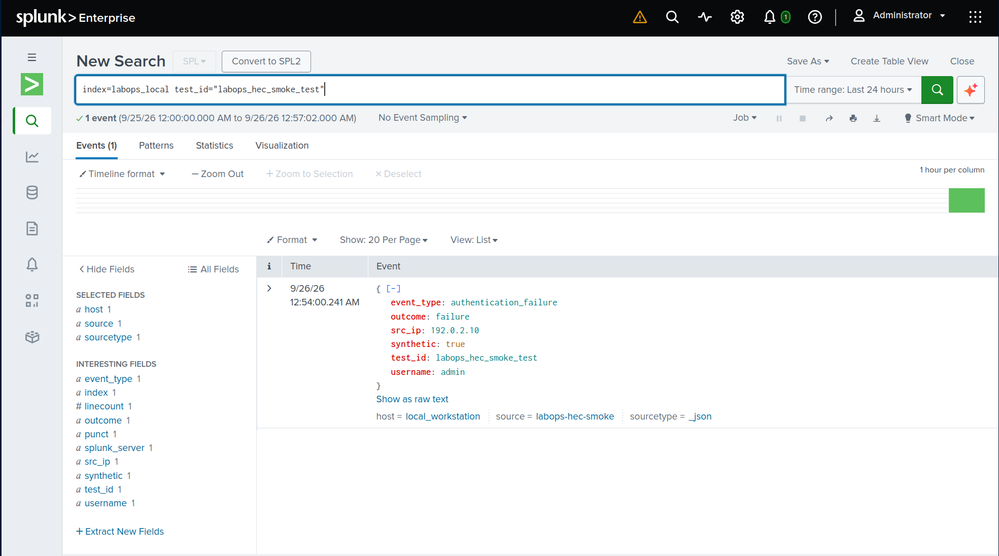
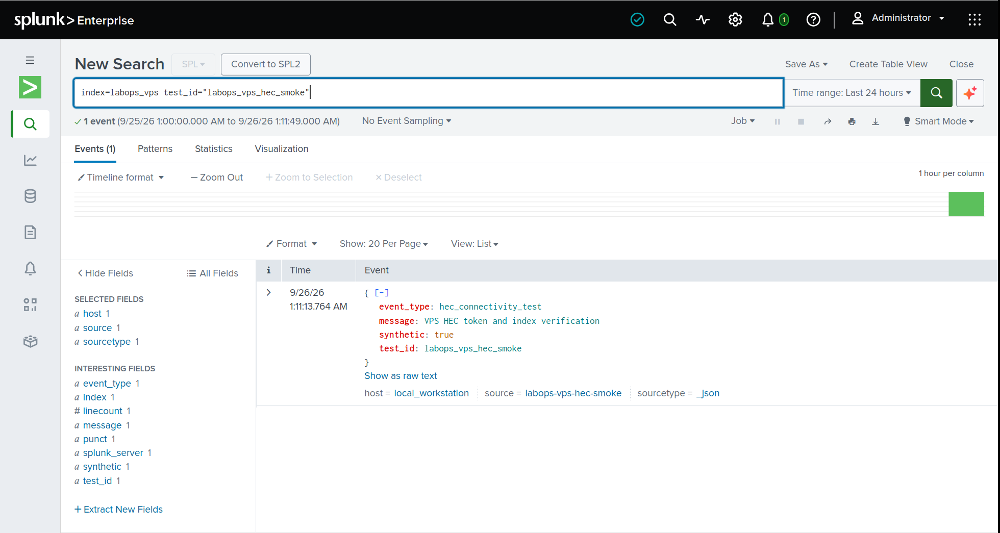
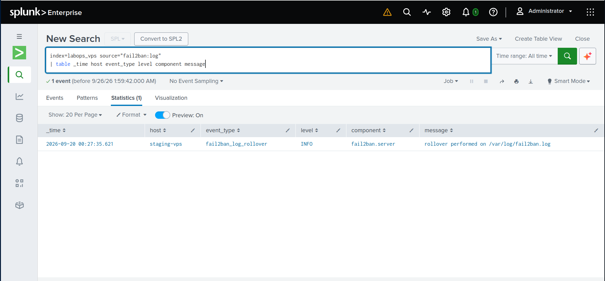

# Splunk LabOps — Security Telemetry Engineering

Splunk Enterprise deployment and automated security telemetry collection from an internet-facing Hetzner VPS hosting live web applications.

> **Deployment (September 2026):** Splunk Enterprise 10.4.3 receives genuine SSH and Fail2Ban security telemetry from a remote Debian VPS through two Python collectors and authenticated HTTPS HEC. Five-minute systemd timers, persistent collection checkpoints, original event timestamps, and automated tests support repeatable collection. Structured SSH authentication fields have also been verified in live Splunk events.

## Project overview

I deployed Splunk Enterprise 10.4.3 in Docker on a Debian 12 host and engineered an automated collection pipeline for a live Hetzner-hosted Debian 13 VPS serving web applications. The Python collector retrieves OpenSSH journal events over key-authenticated SSH, normalizes them, and forwards them through authenticated HTTPS Event Collector (HEC) into a dedicated Splunk index. A systemd timer runs collection every five minutes, with durable journal cursor checkpoints and preserved source timestamps.

The implementation covers Splunk platform administration, remote Linux security telemetry, Python/API integration, secure transport, event lifecycle management, and automated testing. The operational collectors ingest the VPS's SSH service journal and Fail2Ban log. Apache remains a planned data-source integration.

## Architecture

```text
Hetzner VPS hosting live web applications (Debian 13)
    |
    | OpenSSH / ssh.service systemd journal
    | Fail2Ban /var/log/fail2ban.log
    | workstation-initiated SSH, port 22
    v
Debian 12 workstation
    |
    +-- systemd user timer (every five minutes)
    |     +-- Python SSH journal collector
    |     +-- Python Fail2Ban log collector
    |           +-- remote journal cursor / original timestamps
    |           +-- event classification / source IP extraction
    |           +-- CA-verified and pinned localhost HEC TLS
    |           v
    |       Splunk HEC: https://127.0.0.1:18088
    |           +-- labops_vps
    |
    +-- Splunk Enterprise 10.4.3 (Docker Compose)
    |     +-- Splunk Web: http://127.0.0.1:18000
    |     +-- configuration: /mnt/labops-splunk/etc
    |     +-- indexes/runtime data: /mnt/labops-splunk/var
    |     +-- labops_local
    |     +-- labops_aws (configured; AWS ingestion not active)
    |
    +-- Porter / Prometheus / Grafana (separate deployment)
```

Only Splunk Web and HEC are host-published, both on workstation loopback. The workstation pulls logs from Hetzner over its existing key-authenticated SSH connection. There is no public Splunk listener and no Splunk HEC credential on the VPS. The internal Docker-exposed Splunk ports are not mapped to host interfaces.

## Deployment configuration

| Item | Value |
| --- | --- |
| Host | Debian 12 workstation |
| Container image | `splunk/splunk:10.4.3` |
| Docker Compose project | `labops-splunk` |
| Container name | `labops-splunk-splunk-1` |
| Compose file | `~/.config/labops-splunk/compose.yaml` |
| Private environment file | `~/.config/labops-splunk/compose.env` — **never commit** |
| Persistent Splunk configuration | `/mnt/labops-splunk/etc` |
| Persistent Splunk runtime/index data | `/mnt/labops-splunk/var` |
| Web endpoint | `http://127.0.0.1:18000` (verified) |
| HEC endpoint | `https://127.0.0.1:18088` (verified; loopback only) |
| Container limits | 8 GiB memory; 4 CPUs |
| Docker JSON logs | 10 MB/file × 3 rotated files |
| Initial storage planning target | Approximately 20 GB; **not an enforced disk quota** |

**Storage design:** `/mnt/labops-splunk` resides on the workstation's existing LUKS-encrypted ext4 **root filesystem** (`/dev/mapper/luksroot`); `/mnt` is not a separate disk. After the smoke test, the persistent configuration directory measured about **1.2 GB**, runtime/index data about **1.4 GB**, and the root filesystem had about **149 GB available** (69% used). Docker image and build-cache usage are additional. Index size limits are retention targets, **not** a hard quota on the whole deployment.

## Provisioning incident and resolution (2026-09-25)

The first startup repeatedly failed at Ansible's `set version fact` task because the startup identity could not read `/opt/splunk/etc/splunk.version`.

Observed diagnostics:

- The unmounted image has the original version file at `/opt/splunk-etc/splunk.version`; the startup script copies that backup into `/opt/splunk/etc`.
- `/mnt/labops-splunk/etc/splunk.version` **had been copied successfully**, but `/mnt/labops-splunk/etc` was `0750`, owned by UID/GID `41812` (Splunk).
- A diagnostic container ran as `uid=999(ansible)` and reported `NOT READABLE` for the file, proving a directory traversal/read-permission issue.
- The operator ran `sudo chmod 755 /mnt/labops-splunk/etc` **only on the top-level configuration directory**, retaining ownership and individual file permissions.
- The existing container was restarted without deleting the configuration, indexes, or private administrator password. Ansible then passed `set version fact`, started Splunk through its CLI, and completed with `ok=87`, `changed=6`, `failed=0`.

The Splunk Web login and sustained `docker ps` health check were subsequently verified. Do not recursively change permissions on `etc` or expose secret-bearing files.

## Index design and ingestion verification

Local overrides live at `$SPLUNK_HOME/etc/system/local/indexes.conf` in the container, backed by `/mnt/labops-splunk/etc/system/local/indexes.conf` on the workstation. The operator verified the effective configuration with `splunk btool indexes list` executed as the Splunk UID (`41812`), rather than relying only on the file contents.

| Index | Maximum indexed size | Time-based retention | Intended use |
| --- | ---: | ---: | --- |
| `labops_local` | 1,024 MB | Up to 7 days | Workstation and local test events |
| `labops_vps` | 2,048 MB | Up to 14 days | Active Hetzner SSH and Fail2Ban telemetry; Apache planned |
| `labops_aws` | 2,048 MB | Up to 14 days | Planned disposable AWS lab telemetry |

The 16 existing Splunk indexes were also assigned smaller per-index limits. The combined **configured index size targets total 12 GiB**. Data can be retired earlier when an index reaches its size limit; absent a frozen archive, retired events are deleted. Configuration, logs, Docker layers, and search artifacts consume additional storage.

**Smoke test (2026-09-26):** A single synthetic JSON file, `labops-smoke.json`, was uploaded through the Splunk Add Data wizard with `_json` source type, host `local_workstation`, and destination index `labops_local`. Splunk extracted the UTC timestamp and JSON fields. Search & Reporting returned **one matching event** for:

```spl
index=labops_local "labops_smoke_test"
```

This initial test established the ingestion and search path before programmatic HEC and live Hetzner SSH journal collection were added.

## HEC ingestion and Hetzner SSH journal collector

### Dedicated HEC credentials

HTTP Event Collector is enabled over HTTPS on workstation loopback (`127.0.0.1:18088`). Two tokens separate ingestion scope:

| Token name | Allowed and default index | Verified evidence |
| --- | --- | --- |
| `labops-local-hec` | `labops_local` | Indexed and searched a synthetic authentication failure |
| `labops-vps-hec` | `labops_vps` | Indexed and searched a synthetic connectivity event |

Both tokens use the `_json` source type. Token values are saved outside this repository in private, mode-`0600` files under `~/.config/labops-splunk/private/`. Credentials, license files, raw journal exports, and Splunk runtime data stay outside the Git checkout.

The synthetic searches were:

```spl
index=labops_local test_id="labops_hec_smoke_test"
```

```spl
index=labops_vps test_id="labops_vps_hec_smoke"
```





### Live VPS SSH telemetry

[`collectors/hetzner_journal.py`](collectors/hetzner_journal.py) retrieves JSON records from Hetzner's `ssh.service` journal using the existing Ansible inventory and key-authenticated SSH connection. The initial run collects up to the preceding 24 hours; subsequent runs pass the last saved `__CURSOR` to `journalctl --after-cursor`.

The collector preserves `__REALTIME_TIMESTAMP`, records journal cursors, classifies common OpenSSH messages, extracts IPv4/IPv6 source addresses where present, and sends events into `labops_vps` through the local HEC endpoint. The authentication parser additionally extracts `username`, `auth_method`, `key_type`, and `key_fingerprint` when present in an accepted-login message. It uses the configured Splunk CA and a pinned leaf certificate; hostname verification is disabled for the default Splunk certificate, which does not establish a verified `127.0.0.1` identity. A dedicated certificate with a localhost IP Subject Alternative Name remains a hardening improvement. A certificate change requires explicit operator review rather than automatic repinning.

Private state and trust files, kept outside Git:

```text
~/.config/labops-splunk/private/hec-vps.token
~/.config/labops-splunk/private/hec-ca.pem
~/.config/labops-splunk/private/hec-cert.sha256
~/.config/labops-splunk/private/hetzner-ssh.cursor
```

Run a manual collection from the checkout:

```bash
python3 collectors/hetzner_journal.py
```

Search real events in Splunk:

```spl
index=labops_vps source="journal:ssh"
| table _time host event_type src_ip message
| sort - _time
```

Check for duplicated journal cursors:

```spl
index=labops_vps source="journal:ssh"
| stats count as copies by journal_cursor
| where copies > 1
```

The first two manual runs produced 16 indexed SSH events, with no duplicated cursors observed. Additional manual and timer-triggered runs ingested newer records. A returned HTTP 200 / HEC code 0 means the event was accepted, not that completed indexing is guaranteed: indexer acknowledgment is disabled. The pipeline has at-least-once submission semantics, so a crash after HEC acceptance but before writing the cursor can cause duplicates. Recovery is also bounded by journal retention on the VPS.

### Structured SSH authentication fields (September 2026)

Successful public-key SSH messages are parsed into structured fields in new HEC events:

| Field | Meaning |
| --- | --- |
| `username` | SSH account authenticated |
| `auth_method` | Authentication method, such as `publickey` or `password` |
| `key_type` | Key algorithm reported by OpenSSH, when present |
| `key_fingerprint` | Fingerprint reported by OpenSSH, when present |
| `src_ip` | Network origin of the SSH connection |

A search-time SPL extraction matched all **22 observed successful-authentication records** in the initial baseline: one username, one public-key fingerprint, and one source IP (a temporary VPN exit). A subsequent real Hetzner authentication event was indexed with the new structured fields and verified in Splunk. The VPN exit IP is **not** a permanent trusted-source allowlist entry.

For new records carrying structured fields:

```spl
index=labops_vps source="journal:ssh" event_type="ssh_authentication_success"
| where isnotnull(key_fingerprint)
| stats count as successful_logins dc(key_fingerprint) as distinct_keys by username auth_method key_type
```

Previously indexed SSH events retain their original JSON fields and raw `message`. Use `rex` at search time to extract fingerprint fields from older records; modifying the collector does not retroactively rewrite historical events. Do not publish raw VPN addresses, full live authentication messages, or actual credential inventories in public screenshots.

**Detection status:** Credential-based detections and an explicit authorized-key inventory are planned, not yet implemented. A recognized key from a new VPN address still warrants network-origin context; possession of a recognized key does not by itself prove operator identity.

### Automatic collection and tests

The installed user units are tracked in [`systemd/`](systemd/):

- `labops-hetzner.service`: `Type=oneshot` Python collector run as the workstation user.
- `labops-hetzner.timer`: five-minute calendar schedule.

The service file uses workstation-specific absolute paths; adapt them before deploying elsewhere. The first timer-triggered run was verified on September 25, 2026 at 9:25 PM EDT: three SSH journal records were accepted by HEC and the timer scheduled its next activation for 9:30 PM. At that time `Linger=no`; continued operation after the last logout has not been verified.

```bash
python3 -m unittest discover -s tests -v
systemctl --user status labops-hetzner.timer --no-pager
systemctl --user list-timers --all | grep labops
journalctl --user -u labops-hetzner.service -n 30 --no-pager
```

The SSH collector's test coverage includes classification, source-IP parsing (including IPv6), timestamp preservation, cursor handling after a failed HEC submission, and authentication-detail extraction. The current SSH collector tests include the authentication-field coverage described above.

Raw VPS events and credentials remain outside the repository; published screenshots use synthetic or non-sensitive evidence.

## Automated Fail2Ban security telemetry

The second remote collector extends the existing Hetzner security
telemetry pipeline without changing the VPS's enforcement configuration.

Implementation: [hetzner_fail2ban.py](collectors/hetzner_fail2ban.py).

### Source and collection

Fail2Ban is active on the Hetzner VPS with an SSH jail monitoring
systemd journal messages.

The observed jail configuration is:

| Setting | Value |
| --- | --- |
| Jail | sshd |
| Failure threshold | 5 |
| Detection window | 600 seconds |
| Ban duration | 3,600 seconds |
| Log destination | /var/log/fail2ban.log |
| Log level | INFO |

The collector retrieves the Fail2Ban log over the existing
key-authenticated SSH connection. The VPS account can read the log
through its membership in the adm group; the collector does not
require remote root privileges.

Events are submitted through the existing VPS HEC token into
the labops_vps index with source fail2ban:log.

The same CA-validated and certificate-pinned local HEC client is
shared with the SSH journal collector.

### Incremental collection and rotation

Fail2Ban uses a separate state file:

    ~/.config/labops-splunk/private/hetzner-fail2ban-state.json

The file is stored outside Git with permissions 0600.

The collector tracks the current log's filesystem identity and byte
offset. It processes complete lines and advances the stored position
after HEC accepts each event.

When rotation is detected, it attempts to finish the previous log
before collecting the new file. If the previous identity cannot be
located, it stops rather than silently skipping records.

The current implementation handles the active log and its immediate
uncompressed predecessor. It has a 4 MiB per-file collection limit;
compressed historical archives are not collected.

### Event classification

The parser recognizes:

| Event type | Meaning |
| --- | --- |
| fail2ban_failure_detected | Fail2Ban recognized a matching failure |
| fail2ban_ban | Fail2Ban issued a ban |
| fail2ban_unban | Fail2Ban removed a ban |
| fail2ban_log_rollover | Fail2Ban rotated its log |
| fail2ban_error | Fail2Ban reported an error |

Events preserve their original log timestamps.

At implementation time, the active SSH jail reported two detected
failures and zero bans. No real ban or unban event has been observed
or claimed. Synthetic ban/unban examples are used only in unit tests.

### Verified ingestion

The initial manual collection retrieved one genuine Fail2Ban
rollover event dated September 20, 2026.

Splunk Search & Reporting returned that event using:

~~~spl
index=labops_vps source="fail2ban:log"
| table _time host event_type level component message
~~~



A second collection accepted zero additional events, confirming
incremental file-position tracking for the unchanged log.

### Automatic collection

The systemd units are tracked in the repository:

- systemd/labops-fail2ban.service
- systemd/labops-fail2ban.timer

The timer runs every five minutes, offset by two minutes from
the SSH journal collector's schedule.

The first automatic execution was verified on September 25, 2026,
at 10:07 PM EDT. It completed successfully and found zero new
Fail2Ban events, consistent with the unchanged source log.

### Automated tests

Fourteen Fail2Ban-specific unit tests cover event classification,
timestamps, incremental collection, failed HEC submissions,
log rotation, missing rotated files, truncation, and incomplete lines.

The current test suite has **28 passing tests** (14 Fail2Ban + 14 SSH).

Run:

~~~bash
python3 -m unittest discover -s tests -v
~~~

Fail2Ban enforcement settings and firewall actions were not changed
as part of this integration.

## Deployment evidence

The deployment screenshots document the platform setup and initial ingestion checks; HEC ingestion screenshots follow in the collector section above.

### 1. Healthy container and effective index settings

At capture time, the Docker container reported `healthy` and only Splunk Web was host-published. HEC was subsequently published on loopback at `127.0.0.1:18088`. The CLI output independently confirms the three LabOps size and retention settings.


### 2. Dedicated index storage configuration

Splunk Web shows the `labops_vps` index with a **2 GB** maximum and a **128 MB** bucket-size target. The 14-day time limit was verified separately through `btool`.


### 3. Managed index inventory

The Indexes screen shows **19 indexes**, including `labops_aws`, `labops_local`, and `labops_vps`, with the configured per-index maximum sizes. At capture time, `labops_local` contained one test event; the VPS and AWS indexes were empty. The VPS index now contains real SSH events.


### 4. Indexed JSON event and SPL verification

Search & Reporting returns the synthetic event from `labops_local`, showing the extracted JSON fields and metadata (`host=local_workstation`, `sourcetype=_json`).


## Operator commands

Run from the home workstation:

```bash
cd "$HOME/.config/labops-splunk"

# Check all containers without revealing secrets
docker ps -a --filter name=labops-splunk \
  --format 'table {{.Names}}\t{{.Status}}\t{{.Image}}'

# Read recent logs
docker compose --env-file compose.env -p labops-splunk \
  logs --tail=100 splunk

# Validate Compose without printing the interpolated password
docker compose --env-file compose.env -p labops-splunk \
  config --quiet

# Measure Splunk persistent data and remaining filesystem capacity
sudo du -sh /mnt/labops-splunk
df -hT /mnt/labops-splunk
```

Do **not** publish `docker compose config` output, as interpolation can expose secrets. Do not commit `compose.env`, Splunk `etc/` or `var/`, logs, credentials, tokens, license files, or raw VPS/security events.

## Implementation and next milestones

- [x] Inspect workstation capacity and existing services.
- [x] Pull Splunk Enterprise 10.4.3 and create isolated Compose deployment.
- [x] Generate an administrator password in a private, mode-0600 environment file.
- [x] Bind persistent Splunk directories to encrypted ext4 storage.
- [x] Diagnose and resolve first-run provisioning (Ansible `failed=0`).
- [x] Verify healthy container and Splunk Web login.
- [x] Verify the active Developer Personal License (10 GB/day).
- [x] Configure and verify index size/retention limits **before continuous ingestion**.
- [x] Verify localhost-only host port publication and measure root filesystem capacity.
- [x] Upload a controlled local JSON event and retrieve it with SPL.
- [x] Configure authenticated localhost-only HEC with separate local and VPS tokens.
- [x] Index and search synthetic HEC events in both dedicated indexes.
- [x] Collect and search genuine Hetzner SSH journal events over SSH.
- [x] Preserve original journal timestamps and maintain an incremental cursor.
- [x] Verify no duplicate cursors in the first 16 indexed SSH events.
- [x] Pass 23 tests for the committed SSH and Fail2Ban collectors.
- [x] Verify extraction of username, authentication method, key type, and key fingerprint in a real new Hetzner SSH event.
- [x] Pass five additional SSH authentication-field tests locally (28 total; source-code commit pending).
- [x] Verify the five-minute systemd user timer triggers collection.
- [ ] Validate unattended operation after logout and longer connectivity gaps.
- [x] Collect and search genuine Hetzner Fail2Ban logs.
- [x] Implement incremental Fail2Ban collection with rotation handling.
- [x] Verify automatic five-minute Fail2Ban collection.
- [ ] Add Apache telemetry.
- [ ] Maintain a private authorized-key inventory and build credential-based SPL detections.
- [ ] Build additional SPL detections, dashboards, and alerting.
- [ ] Optionally instrument disposable AWS lab runs.


## Repository contents

The repository tracks the Python collector, systemd units, automated tests, index configuration and deployment evidence. Runtime files, secrets, license material, and raw security logs are maintained outside the checkout. The Splunk LabOps repository complements my separate infrastructure automation and Porter projects.
